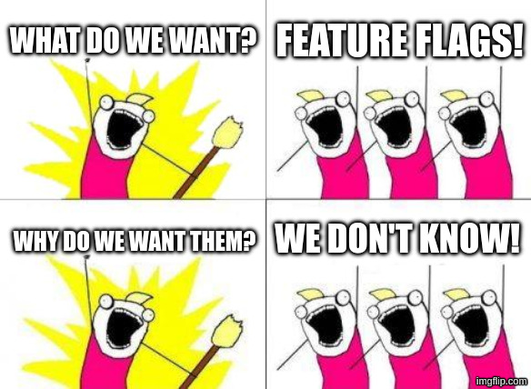

### OpenFeature

###### one flag to rule them all

---

### What are feature flags?

Way to change the system behaviour at runtime without hassle.

---

### What are feature flags (contd.)?

Software development technique that allows enabling, disabling or changing the behaviour of certain features or code paths in a product or a service at runtime, without modifying the source code or re-deployment/service interruption <a href="#footnote-1">[1]</a><a href="#footnote-2">[2]</a>.

<h4></h4>
<ol>
    <li id="footnote-1">https://www.dynatrace.com/news/blog/feature-flags-with-openfeature-and-dynatrace/</li>
    <li id="footnote-1">https://www.youtube.com/watch?v=euYhIn4leW0</li>
</ol>

---

### `whoami`?
* Alexei Bratuhin @ OpenValue Düsseldorf
* Java since `String#contains` didn't exist <a href="#footnote-1">[1]</a>
* actually needed a haircut back then
* not related to Java
* or is it? ;)

<h4></h4>
<ol>
    <li id="footnote-1">appeared in 1.5, in 2004</li>
</ol>

---

### What are feature flags (contd.)?

###### Toggles → boolean-only?

No! Whoever refactored a nested `if/then/else` to a `switch` knows it.

---

---

### Why feature flags (contd.)?

* maintenance switch
* kill switch (data processing)
* feature paywall
* country-specific legislation
* A/B testing

---

### Why feature flags (contd.)?

###### 12factor + K8s?

* no K8s
* no DevOps
* heterogenous landscape
* rare maintenance windows
* etc.

---

### How feature flags?

###### Demo!

Pizza tycoon controversy

---

### How feature flags (contd.)?

###### DiWHY

Custom + in-memory

---

### How feature flags (contd.)?

###### DiWHY

MBean + in-memory

---

### How feature flags (contd.)?

###### Togglz

Togglz + in-memory

---

### How feature flags (contd.)?

###### Togglz

Togglz + in-memory + strategy

---

### How feature flags (contd.)?

###### OpenFeature

Flagd

---

### How feature flags (contd.)?

###### OpenFeature

Flagd + multiple envs

---

### How feature flags (contd.)?

###### OpenFeature

Flagd + multiple envs + multiple apps + fractional

---

### How feature flags (contd.)?

###### OpenFeature (try-it-at-home)

* Hooks<a href="#footnote-1">[1]</a>
* Events<a href="#footnote-1">[1]</a>
* Tracking<a href="#footnote-2">[2]</a>
* Observability<a href="#footnote-2">[2]</a>

<h4></h4>
<ol>
    <li id="footnote-1">hardening</li>
    <li id="footnote-12">experimental</li>
</ol>

---

### How feature flags (contd.)?

* Togglz (https://www.togglz.org/)<a href="#footnote-1">[1]</a>
* OpenFeature (https://openfeature.dev/)
* Quarkus Feature Flags (https://quarkus.io/blog/quarkus-feature-flags/)

<h4></h4>
<ol>
    <li id="footnote-1">https://github.com/coiouhkc/demo-quarkus-togglz</li>
</ol>

---

### How feature flags (contd.)?

###### Caveat scriptor codicis

* amount
* stale flags
* obsolete/ outdated comments/ documentation
* combinatorial explosion of testing effort
* feature flag inter-dependencies

---

# Q&A